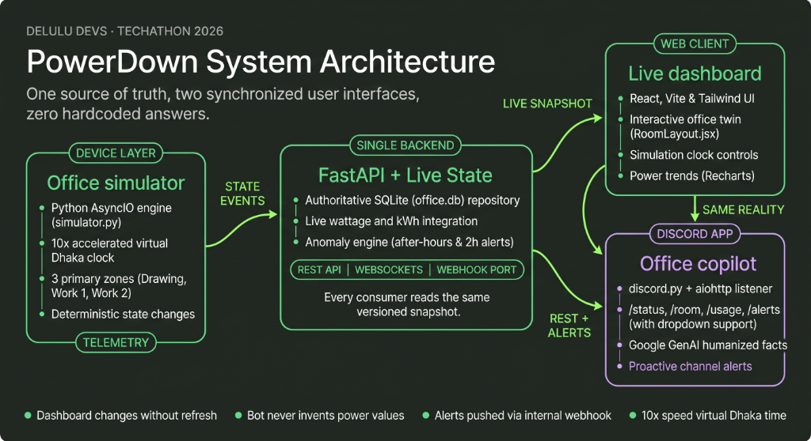

# PowerView

### A real-time digital twin and AI-powered Discord assistant.

PowerView gives an office one synchronized view of every light, fan, and energy anomaly. A live React web dashboard and a Discord Copilot bot both read from the same FastAPI backend, ensuring the numbers never disagree.



[Wokwi Hardware Schematic](https://wokwi.com/projects/468613327019371521)

[](https://www.youtube.com/watch?v=YOUR_VIDEO_ID)
*Placeholder: Click to watch the 3-Minute YouTube Video Demo*

## Problem understanding

Employees sometimes leave lights and fans running after work, wasting energy and inflating operational costs. The office needs:

- A live room-by-room device status view without page refreshes.
- Current office power and per-room breakdowns.
- Timestamped alerts for devices left on after 5 PM or an entire room running continuously for more than two hours.
- A friendly Discord Copilot bot to answer queries using the same current state.
- A representative, electrically sensible hardware concept.

## Architecture overview

The system relies on a **single-source-of-truth architecture**. 
The FastAPI backend owns the only mutable device store (SQLite) and runs a deterministic time simulator. Fast WebSockets broadcast a versioned snapshot to the React Dashboard, while the Discord Copilot bot queries the same REST API. The alert engine also publishes newly triggered anomalies to a configured Discord channel via an internal aiohttp webhook.

## Core Features

- **Live Digital Twin**: Real-time React/Tailwind dashboard monitoring exactly 18 devices (fans and lights) across 3 mapped rooms (Drawing Room, Work Room 1, Work Room 2).
- **10x Simulation Engine**: A backend-driven time simulator that accelerates time for live anomaly generation, completely synced via WebSockets.
- **Discord Copilot**: A Python `discord.py` bot integrating **Google Gemini 2.5 Flash** to provide humanized office status summaries and proactive usage alerts via an internal aiohttp webhook.
- Live watts, integrated kWh, estimated cost, and dynamic room breakdowns.
- Dedicated After-hours and 2-hour Anomaly scenarios.

## Technology stack

| Layer | Technology |
|---|---|
| Dashboard | React, Vite, Tailwind CSS |
| Backend API | FastAPI, Python, SQLite |
| Realtime transport | WebSockets |
| Discord Copilot | discord.py, aiohttp |
| AI Integration | google-genai (Gemini 2.5 Flash) |
| Hardware concept | ESP32, Wokwi, relay-isolated loads |

## Repository structure

```text
├── backend/       FastAPI REST API, WebSockets, simulator, and SQLite DB
├── frontend/      Vite + React realtime dashboard with Tailwind CSS
├── bot/           Discord Copilot bot (discord.py + Gemini 2.5 Flash)
├── docs/          Architecture diagrams and presentation assets
└── hardware/
    └── wokwi/     Representative one-room ESP32 circuit and firmware
```

## Setup Instructions

### Prerequisites

- Python 3.10 or newer
- Node.js 18 or newer
- A Discord application for bot features
- Google Gemini API Key

### Installation & Running

You need to run three distinct services in separate terminal windows.

**1. Running the FastAPI backend:**
```bash
cd backend
pip install -r requirements.txt
uvicorn app.main:app --reload --port 8000
```
*The API and WebSocket server will run on `http://localhost:8000`.*

**2. Running the Vite frontend:**
```bash
cd frontend
npm install
npm run dev
```
*Open `http://localhost:5173` in your browser.*

**3. Running the Discord bot:**
Before starting the bot, ensure you configure your environment variables. Create a `.env` file in the `bot/` directory (or export them):
- `DISCORD_TOKEN`
- `GEMINI_API_KEY`
- `DISCORD_CHANNEL_ID`

```bash
cd bot
pip install -r requirements.txt
python main.py
```

## Environment variables

| Variable | Required | Purpose |
|---|---|---|
| `DISCORD_TOKEN` | Bot | Discord bot authentication token |
| `GEMINI_API_KEY` | Bot | Google Gemini API key for natural language AI |
| `DISCORD_CHANNEL_ID` | Bot | Discord channel for proactive alert webhooks |

*Never commit your real `.env` file or API tokens.*

## API endpoints

| Method | Endpoint | Purpose |
|---|---|---|
| `GET` | `/api/devices` | All 15 current device states |
| `GET` | `/api/power/summary` | Office and room power/energy totals |
| `GET` | `/api/alerts` | Current active alerts |
| `POST` | `/api/devices/:deviceId/toggle` | Simulate one physical state change |
| `POST` | `/api/simulation/scenarios/:scenarioId` | Activate a deterministic demo |

The WebSocket server at `ws://localhost:8000/ws/devices` broadcasts state updates (`state_update`), time ticks (`time_tick`), and alerts (`alert_triggered`, `alert_updated`).

## Discord Bot Setup

1. Create an application and bot in the Discord Developer Portal.
2. Enable the **Message Content intent**.
3. Invite the bot to your server.
4. Set `DISCORD_TOKEN`, `GEMINI_API_KEY`, and `DISCORD_CHANNEL_ID` in your `.env`.
5. Run the bot.

The bot uses **Gemini 2.5 Flash** to provide highly contextual, humanized answers based on the live backend data. Try commands like `/status`, `/usage`, or `/alerts`.

## Simulation scenarios

| Scenario | Demonstrates |
|---|---|
| Normal day | Resets to 9:00 AM, randomizes device states |
| After-Hours Leak | Jumps to 7:00 PM with Work Room 2 running |
| 2-Hour Overtime | Fast-forwards clock by 2 hours with Work Room 1 devices ON |
| Shutdown | Turns all devices OFF and clears active alerts |

## Hardware design

The [`hardware/wokwi`](hardware/wokwi) directory contains:
- `diagram.json` - ESP32 circuit design.
- `sketch.ino` - State reading, relay control, and telemetry.
- `README.md` - Pin mapping and electrical safety notes.

## Demo sequence

1. Open the **React Dashboard** to show the live digital twin.
2. Trigger the **After-Hours Leak** simulation to demonstrate real-time WebSocket alerts and instant power spikes.
3. Show the **Discord Copilot** reacting proactively in the Discord channel.
4. Ask the Copilot `/status` to see Gemini 2.5 Flash generate a humanized summary of the live JSON data.
5. Trigger **2-Hour Overtime** to demonstrate the continuous overuse logic.
6. Toggle a device on the dashboard manually to show instant synchronization.

## Team

Built by **Team Delulu Devs**. 

## Team

**Team CLI** — Techathon Nationals & Rover Summit Hackathon '26'

| Name | GitHub | Email |
|------|--------|-------|
| Muntakim Fuad Mahi | @sugar6169 | muntakimfm@gmail.com |
| Anha Khan | @Anha-Khan | anhakhan0111@gmail.com |
| Abrar Faiyaz Arian | @abrar-arian | member3@example.com |
| Ahad Kaiser Tamim | @amoxicillin23 | ahadkaisertamim23.akt@gmail.com |
